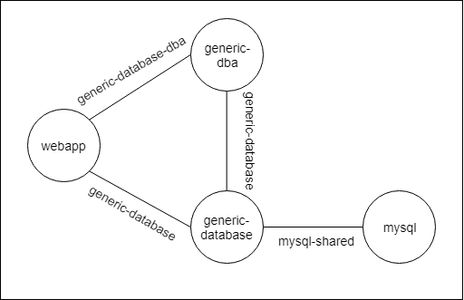

# Generic Database DBA

## Introduction 

This section briefly discusses the concepts of the generic database DBA service. It introduces the concepts on how to create this service. The generic database dba charm uses the generic database as presented [here](https://github.com/Ciberth/gdb-use-case). Both the generic database charm and the generic database dba charm could be merged together into one service. This appendix will show that even with the atomic generic database charm it is also possible to offer all functionalities without losing the semantic meaning of a (standalone) database representation. A prototype of this service is available at [https://github.com/Ciberth/MP-appendix-b/](https://github.com/Ciberth/MP-appendix-b/).


## Design 

Once again the webapp charm is the requesting service a database but in this use case, the setup is not finished once the config file is rendered. Afterwards the database is populated with the help of a SQL-query. The webapp charm will therefore be connected to a generic database charm that on its turn is connected to the mysql charm. Finally the webapp also has a relation with the new generic database dba charm and the latter is connected with the atomic generic database charm. The following figure shows the application model. Once again the apache-layer is used to set up a webserver as Adminer.php will offer connection possibilities to databases. Other webapplications could be used as well.



The idea behind this service could be summarised in code as follows:

```python
@when('endpoint.dba.available')
def populate_database():
    dba = endpoint_from_flag('endpoint.dba.available')
    # could be read from a file
    query = """
        CREATE TABLE Persons (id int, lastname varchar(255), firstname varchar(255));
        INSERT INTO Persons (id, lastname, firstname) VALUES (0, "admin", "admin");
        INSERT INTO Persons (id, lastname, firstname) VALUES (1, "test", "test");
    """
    # Example to run a query
    dba.execute_query(query)

    # Example to add a user
    """
    parameters: 1. user ; 
                2. password ; 
                3. hostname of database (already known thanks to generic database)
                4. databasename (already known thanks to generic database)
                4. privileges
    """
    dba.add_user('user', 'password', database_info['hostname'], database_info['dbname'], "ALL PRIVILEGES")
    

@when('endpoint.dba.operation')
def check_on_errors():
    dba = endpoint_from_flag('endpoint.dba.operation')
    if dba.error():
        status_set('maintenance','Error occured: %s' % dba.error())
    else:
        status_set('active', 'Webapp ready!')
```